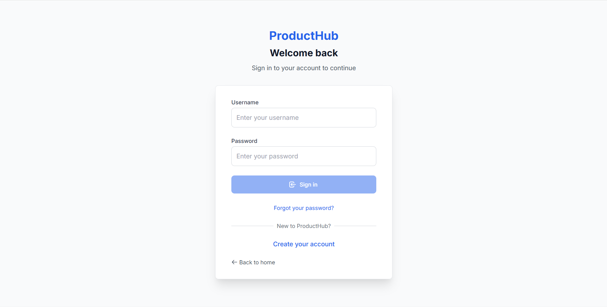
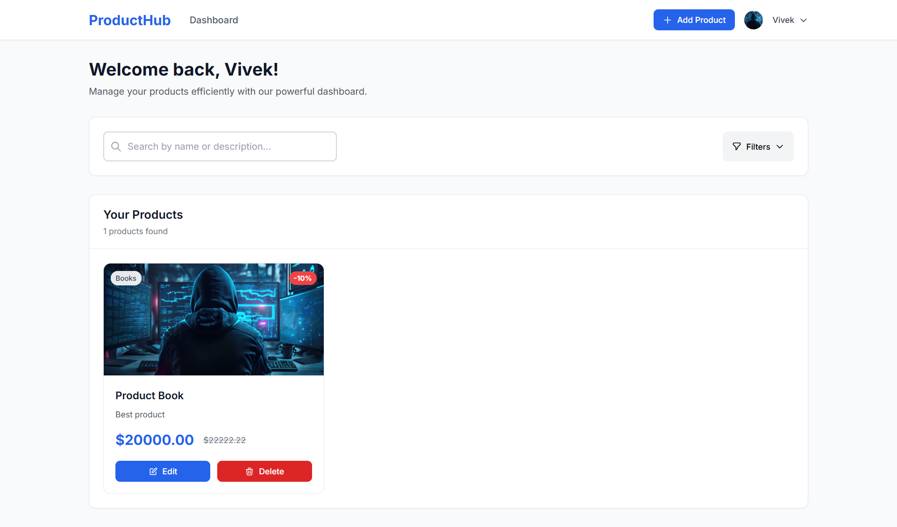
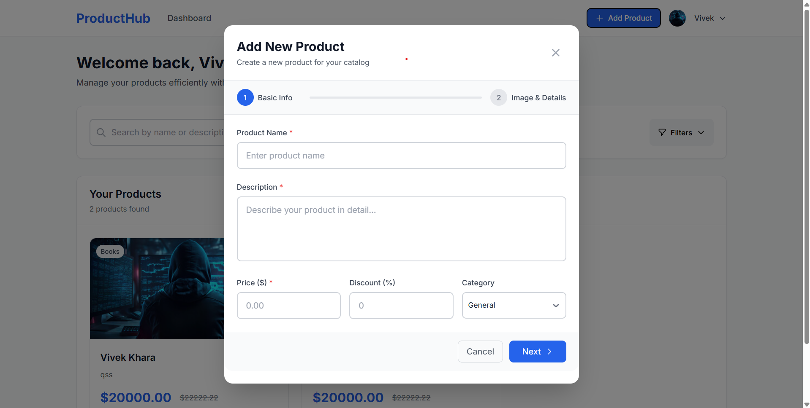

# 🚀 ProductHub - Complete CRUD Application

A modern, full-stack web application built with **React.js** and **Node.js** featuring user authentication, product management, and a beautiful responsive UI.

[](https://reactjs.org/)
[](https://nodejs.org/)
[](https://mongodb.com/)
[](https://expressjs.com/)

## 📋 Table of Contents

- [Features](#-features)
- [Demo Screenshots](#-demo-screenshots)
- [Tech Stack](#-tech-stack)
- [Prerequisites](#-prerequisites)
- [Installation](#-installation)
- [Usage](#-usage)
- [API Endpoints](#-api-endpoints)
- [Project Structure](#-project-structure)
- [Features in Detail](#-features-in-detail)
- [Contributing](#-contributing)
- [License](#-license)

## ✨ Features

### 🔐 **Authentication System**

- User Registration with profile image upload
- Secure Login/Logout with JWT tokens
- Forgot Password functionality with username verification
- Profile Edit with image upload capabilities
- Password encryption using bcrypt

### 📦 **Product Management (CRUD)**

- ➕ **Create**: Add new products with images, categories, and details
- 📖 **Read**: View products in a beautiful card-based layout
- ✏️ **Update**: Edit existing product information and images
- 🗑️ **Delete**: Remove products with confirmation dialogs
- 🔍 **Advanced Search & Filters**: Search by name, filter by category, price range, and sorting

### 🎨 **Modern UI/UX**

- Responsive design that works on all devices
- Beautiful gradient backgrounds and animations
- Modern card layouts with hover effects
- Loading states and skeleton screens
- Interactive modals and forms
- SweetAlert2 for beautiful notifications
- React-Select for enhanced dropdowns

### 📱 **Additional Features**

- Image upload and preview functionality
- File type and size validation
- Pagination for product listings
- Real-time form validation
- Error handling and user feedback
- SEO-friendly routing

## 📸 Demo Screenshots

### Login & Registration


_Beautiful login interface with forgot password option_

### Dashboard


_Modern product management dashboard with advanced filters_

### Product Management


_Step-by-step product creation form with image upload_

### Profile Management


_Profile editing with image upload capabilities_

## 🛠️ Tech Stack

### Frontend

- **React.js 18+** - Modern JavaScript library for building user interfaces
- **React Router** - Client-side routing
- **Axios** - HTTP client for API requests
- **React-Select** - Enhanced select components
- **SweetAlert2** - Beautiful alert dialogs
- **Tailwind CSS** - Utility-first CSS framework
- **Modern CSS** - Custom animations and responsive design

### Backend

- **Node.js** - JavaScript runtime environment
- **Express.js** - Fast web framework for Node.js
- **MongoDB** - NoSQL database for data storage
- **Mongoose** - MongoDB object modeling
- **JWT** - JSON Web Tokens for authentication
- **Bcrypt** - Password hashing library
- **Multer** - Middleware for handling file uploads
- **CORS** - Cross-origin resource sharing

## 📋 Prerequisites

Before running this application, make sure you have the following installed:

- **Node.js** (v14.0 or higher)
- **npm** or **yarn** package manager
- **MongoDB** (local installation or MongoDB Atlas)
- **Git** (for version control)

## 🚀 Installation

### 1. Clone the Repository

```bash
git clone https://github.com/yourusername/producthub-crud-app.git
cd producthub-crud-app
```

### 2. Backend Setup

```bash
# Navigate to backend directory
cd backend

# Install dependencies
npm install

# Create .env file (optional - using default MongoDB connection)
echo "MONGODB_URI=mongodb://localhost:27017/productDB" > .env
echo "JWT_SECRET=shhhhh11111" >> .env
echo "PORT=2000" >> .env

# Start MongoDB service (if running locally)
# Windows: net start MongoDB
# macOS/Linux: sudo systemctl start mongod

# Start the backend server
npm start
```

### 3. Frontend Setup

```bash
# Open a new terminal and navigate to frontend directory
cd frontend

# Install dependencies
npm install

# Start the React development server
npm start
```

### 4. Access the Application

- **Frontend**: http://localhost:3000
- **Backend API**: http://localhost:2000
- **MongoDB**: mongodb://localhost:27017

## 🎯 Usage

### Getting Started

1. **Register** a new account with your details and profile picture
2. **Login** using your credentials
3. **Add Products** using the "Add New Product" button
4. **Manage Products** - edit, delete, or search through your products
5. **Update Profile** - change your name, username, or profile picture
6. **Use Filters** - search by name, filter by category, price range, and sort options

### Default Test Account

For testing purposes, you can create a new account or use the registration system.

## 📡 API Endpoints

### Authentication

```http
POST /register          # Register new user
POST /login            # User login
POST /check-user       # Verify username (forgot password)
POST /reset-password   # Reset user password
GET  /user-info        # Get current user info
PUT  /update-profile   # Update user profile
```

### Products

```http
GET    /get-product     # Get products with pagination & filters
POST   /create-product  # Create new product
PUT    /update-product/:id # Update existing product
DELETE /delete-product  # Delete product (soft delete)
```

### File Uploads

```http
GET /uploads/:filename  # Serve uploaded images
```

### Query Parameters for Products

```
?page=1                 # Pagination
?search=keyword         # Search in name/description
?category=Electronics   # Filter by category
?priceMin=100          # Minimum price filter
?priceMax=500          # Maximum price filter
?sortBy=newest         # Sort options: newest, price_low, price_high, name
```

## 📁 Project Structure

```
producthub-crud-app/
├── backend/
│   ├── model/
│   │   ├── user.js              # User schema
│   │   └── product.js           # Product schema
│   ├── uploads/                 # Image upload directory
│   ├── server.js               # Main server file
│   └── package.json            # Backend dependencies
├── frontend/
│   ├── public/
│   │   ├── index.html
│   │   └── manifest.json
│   ├── src/
│   │   ├── components/          # Reusable components
│   │   │   ├── Navbar.js
│   │   │   └── Footer/
│   │   ├── Body/               # Page components
│   │   ├── layout/             # Layout components
│   │   ├── assets/             # Static assets
│   │   ├── Dashboard.js        # Main dashboard
│   │   ├── Login.js           # Login component
│   │   ├── Register.js        # Registration component
│   │   ├── ForgotPassword.js  # Forgot password component
│   │   ├── ProfileEdit.js     # Profile editing
│   │   ├── Leading.js         # Landing page
│   │   ├── modern-styles.css  # Custom CSS
│   │   ├── index.js          # App entry point
│   │   └── utils.js          # Utility functions
│   └── package.json          # Frontend dependencies
├── screenshots/              # Demo images
├── README.md                # Project documentation
└── .gitignore              # Git ignore file
```

## 🔥 Features in Detail

### 🛡️ Security Features

- **JWT Authentication** - Secure token-based authentication
- **Password Hashing** - Bcrypt encryption for password security
- **File Upload Validation** - Type and size restrictions for images
- **Input Sanitization** - Protection against malicious inputs
- **CORS Configuration** - Proper cross-origin resource sharing setup

### 🎨 UI/UX Features

- **Responsive Design** - Works perfectly on mobile, tablet, and desktop
- **Loading States** - Skeleton screens and loading indicators
- **Form Validation** - Real-time validation with error messages
- **Image Previews** - Preview images before uploading
- **Interactive Animations** - Smooth transitions and hover effects
- **Modern Typography** - Google Fonts integration (Inter & Poppins)

### 📊 Product Management

- **Advanced Filtering** - Multiple filter options with real-time results
- **Image Management** - Upload, preview, and update product images
- **Category System** - Organized product categorization
- **Price Management** - Price filtering and sorting capabilities
- **Pagination** - Efficient data loading with page navigation

### 👤 User Management

- **Profile Customization** - Update name, username, and profile picture
- **Password Recovery** - Secure forgot password functionality
- **User Sessions** - Persistent login with JWT tokens
- **Profile Images** - Upload and manage profile pictures

## 🔧 Configuration

### Environment Variables (Backend)

```env
MONGODB_URI=mongodb://localhost:27017/productDB
JWT_SECRET=your-secret-key-here
PORT=2000
```

### Default Configuration

- **Database**: MongoDB on localhost:27017
- **Backend Port**: 2000
- **Frontend Port**: 3000
- **Image Upload Limit**: 5MB
- **Supported Image Formats**: JPG, JPEG, PNG

## 🚨 Troubleshooting

### Common Issues

**1. MongoDB Connection Error**

```bash
# Make sure MongoDB is running
# Windows: net start MongoDB
# macOS/Linux: sudo systemctl start mongod
```

**2. Port Already in Use**

```bash
# Kill process on port 2000
npx kill-port 2000

# Or change port in backend/server.js
app.listen(3001, () => console.log("Server running on port 3001"));
```

**3. Image Upload Issues**

- Check if `uploads` folder exists in backend directory
- Verify file permissions
- Ensure image size is under 5MB

**4. Login Issues After Password Reset**

- Clear browser localStorage
- Make sure backend server is running
- Check browser console for errors

## 🤝 Contributing

Contributions are welcome! Please feel free to submit a Pull Request.

### Steps to Contribute:

1. Fork the repository
2. Create a feature branch (`git checkout -b feature/AmazingFeature`)
3. Commit your changes (`git commit -m 'Add some AmazingFeature'`)
4. Push to the branch (`git push origin feature/AmazingFeature`)
5. Open a Pull Request

## 📝 License

This project is licensed under the MIT License - see the [LICENSE](LICENSE) file for details.

## 🙏 Acknowledgments

- **React Community** for the amazing ecosystem
- **Node.js** for the powerful backend runtime
- **MongoDB** for the flexible database solution
- **Tailwind CSS** for the utility-first CSS framework
- **SweetAlert2** for beautiful notifications
- **All Contributors** who helped make this project better

## 🌟 Show Your Support

If this project helped you, please give it a ⭐️ on GitHub!

---

**Built with ❤️ using React.js and Node.js**
